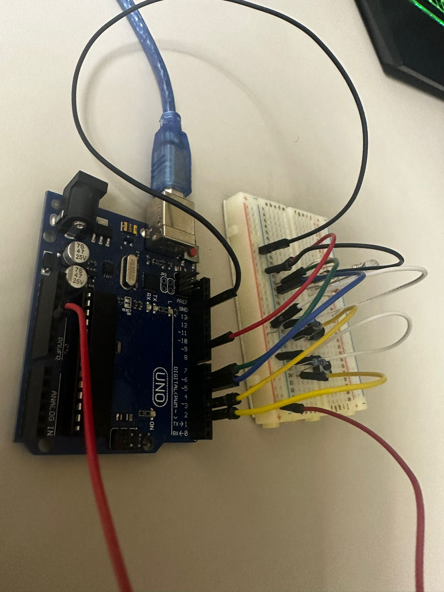
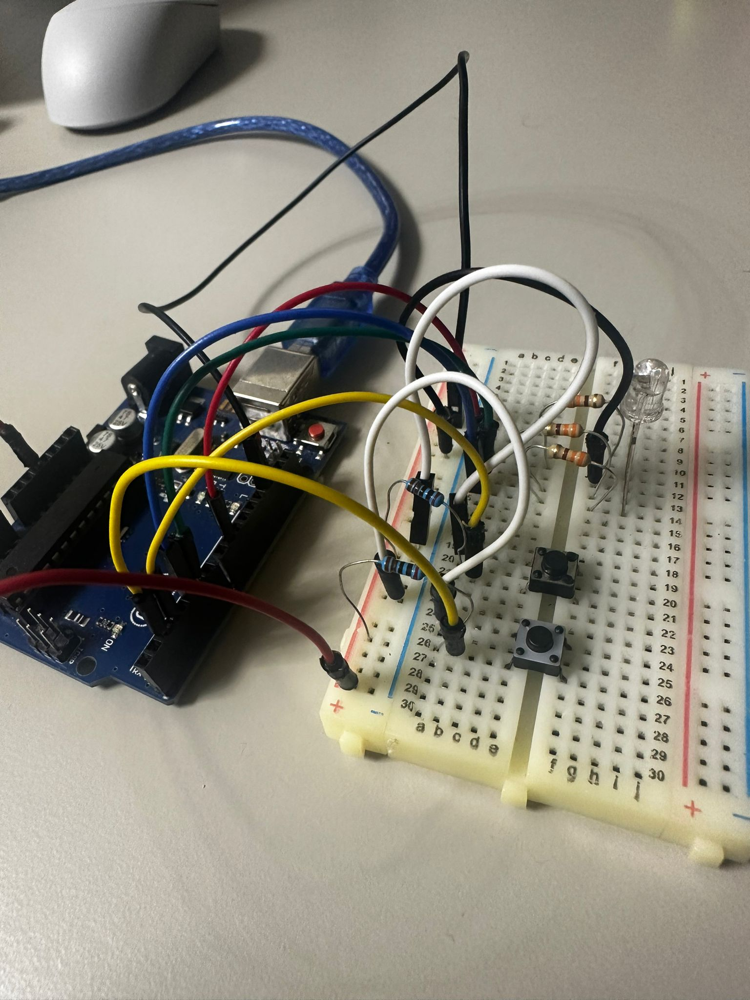
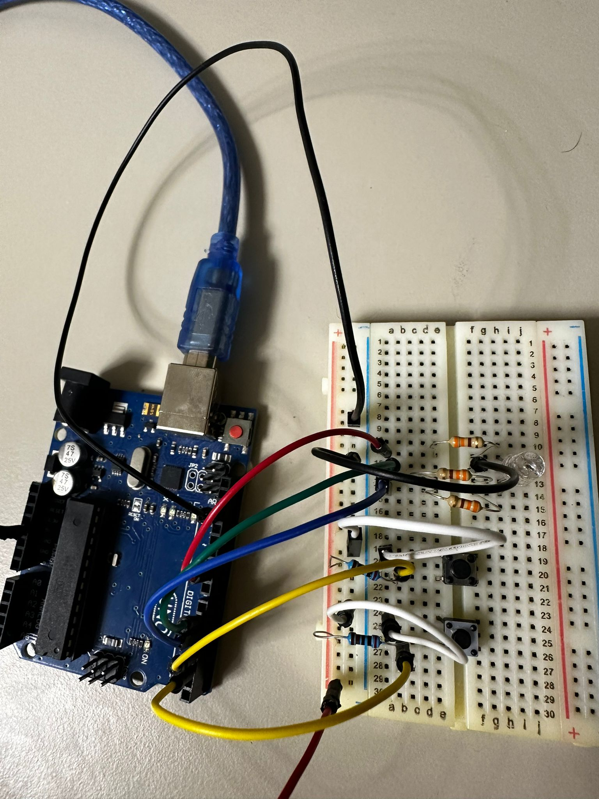
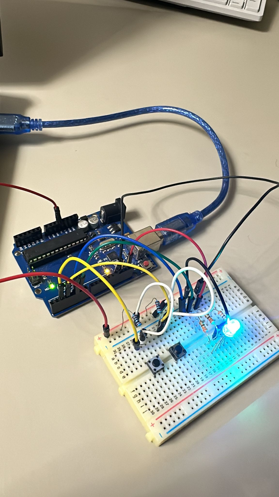
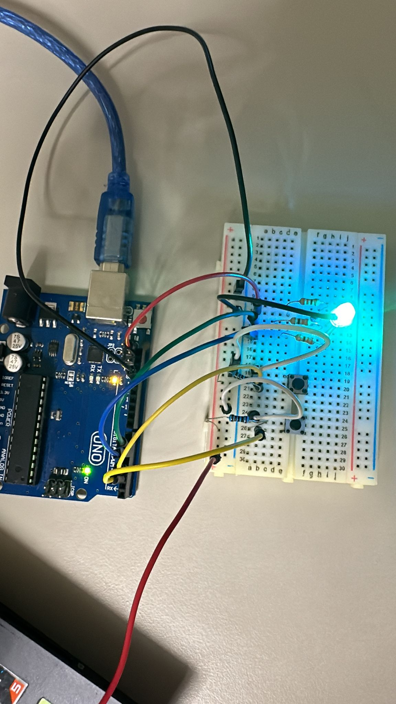
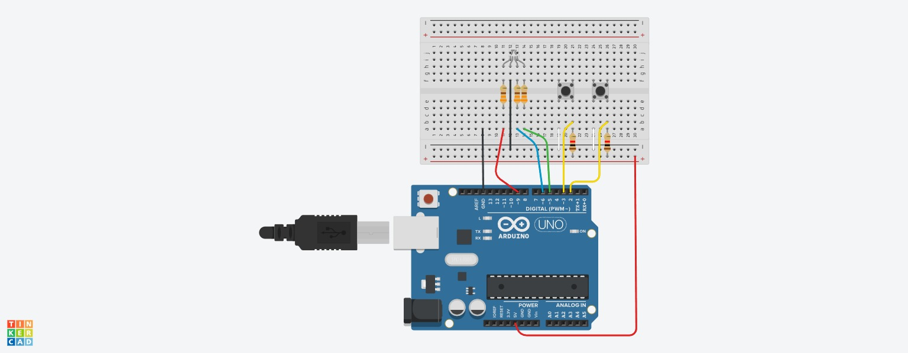

# Tema 2 - TypeRacer Game

### Cerinta si Flow

Acest proiect simuleaza jocul TypeRacer ( https://play.typeracer.com/ ) folosind o placa Arduino UNO si componentele specificate mai jos.

#### Flow

- Jocul este în repaus. LED-ul RGB are culoarea albă.
- Se alege dificultatea jocului folosind butonul de dificultate, iar în terminal va apărea “Easy/Medium/Hard mode on!”.
- Se apasă butonul de start/stop.
- LED-ul clipește timp de 3 secunde, iar în terminal se va afișa numărătoarea înversă: 3, 2, 1.
- LED-ul devine verde și încep să apară cuvinte de tastat.
- La tastarea corectă, următorul cuvânt apare imediat. Dacă nu se tasteaza cuvântul în timpul stabilit de dificultate, va apărea un nou cuvânt.
- O greșeală face LED-ul să devină roșu. Pentru a corecta cuvântul, se va folosi tasta BackSpace.
- Dupa 30 de secunde, runda se termină, iar în terminal se va afișa scorul: numărul total de cuvinte scrise corect.
- Jocul se poate opri oricând cu butonul de start/stop.

### Componente utilizate

- Arduino UNO (ATmega328P microcontroller);

- 1x LED RGB (pentru a semnaliza dacă cuvântul corect e scris greșit sau nu);

- 2x Butoane (pentru start/stop rundă și pentru selectarea dificultății);

- 5x Rezistoare (3x 220/330 ohm, 2x 1000 ohm);

- Breadbord;

- Fire de legătură.

### Poze ale setup-ului fizic

### Video cu functionalitatea montajului fizic

https://youtube.com/shorts/WR6shfnnoUE 

### Schema electrica

